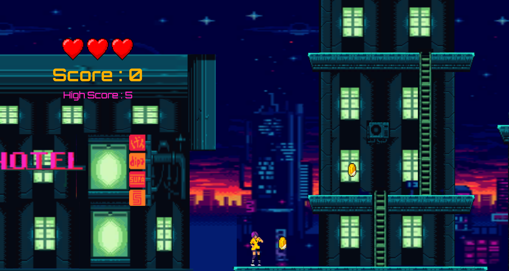

# Cyberpixels Arcade Game
> Action Shooting Games built using Unity.
> Download [_here_](https://drive.google.com/file/d/1IiOFReh1Cd_k3t_ha2MLiWRy4YiBds73/view?usp=sharing).

## Table of Contents
* [General Info](#general-information)
* [Technologies Used](#technologies-used)
* [Features](#features)
* [Screenshots](#screenshots)
* [Project Status](#project-status)
* [Room for Improvement](#room-for-improvement)
* [Acknowledgements](#acknowledgements)
* [Contact](#contact)

## General Information
- Cyberpixel's Arcade is a retro 2d shooting game set in a cyber city in the future.
- Objective of this game is very simple where players must be able to survive or pass obstacles and meet their partner at the end of the game.

## Technologies Used
- Unity - version 2021

## Features
- Single player.
- Highscore system.
- Kill the enemy to get score.
- Save progress.

## Screenshots

## Project Status
Project is: _in progress._ <!-- / _complete_ / _no longer being worked on_. reason ? -->

## Room for Improvement

Room for improvement:
- Add multiplayer.
- Add some levels.
- Add advance AI to better experience while playing this game.

To do:
- Create a dynamic bot trap.
- Fix some bugs when player shooting the enemy.

## Contact

Created by [@Zulhaditya](https://zulhaditya.vercel.app) - feel free to contact me!
